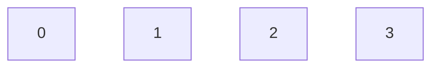
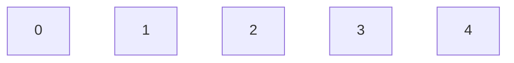

# Fibonacci_Heap
Фибоначчиева куча - набор деревьев, удовлетворяющих правилу: значение каждого из дочерних узлов не превышает значение родительского.

Узел нужен для представления кучи в виде двусвязного списка, он хранит указатели на левый, правый узлы и дополнительные ссылки на своего родителя(может быть нулевым) и на своего последнего ребенка(может быть нулевым). Также узлы хранят значени, количество своих детей и особую булевскую переменную mark, которая изначально равна false.

Класс Фибоначчиева куча тоже представлена в виде двусвязного списка, она хранит указатели на начальный и на конечный узлы. В дополнении, для быстрой работы с кучей, как с приоритетной очередью, в ней хранится указатель на минимальный элемент, а также количество узлов в ней.

## Основные функции:

###Insert
Данная функция вставляет в кучу узел в качестве корневого. Корневой узел - тот, у которого нет родителей.
Результатом нескольких вызовов Insert подряд будет двусвязный список. Например, если есть фибоначчиево дерево

то результатом Insert(4) будет

